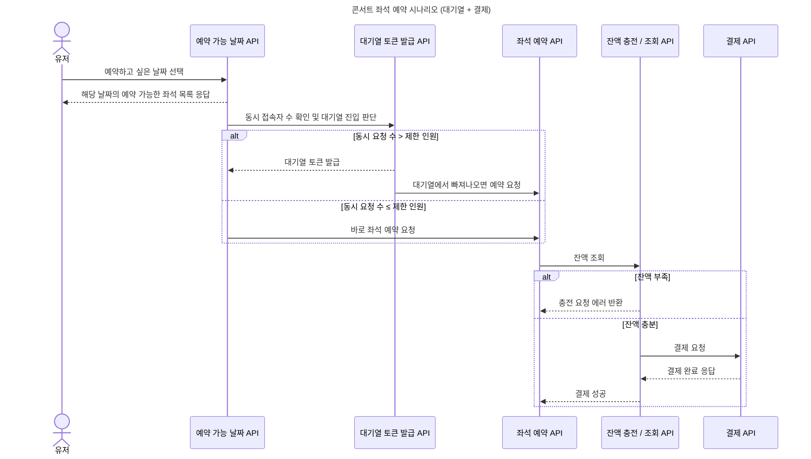

```mermaid

sequenceDiagram
    title 콘서트 좌석 예약 시나리오 (대기열 + 결제)

    actor User as 유저
    participant AccessDateAPI as 예약 가능 날짜 API
    participant WaitingQueueAPI as 대기열 토큰 발급 API
    participant SeatReservationAPI as 좌석 예약 API
    participant PointAPI as 잔액 충전 / 조회 API
    participant PaymentAPI as 결제 API

    User ->> AccessDateAPI : 예약하고 싶은 날짜 선택
    AccessDateAPI -->> User : 해당 날짜의 예약 가능한 좌석 목록 응답

    AccessDateAPI ->> WaitingQueueAPI : 동시 접속자 수 확인 및 대기열 진입 판단

    alt 동시 요청 수 > 제한 인원
        WaitingQueueAPI -->> AccessDateAPI : 대기열 토큰 발급
        WaitingQueueAPI ->> SeatReservationAPI : 대기열에서 빠져나오면 예약 요청
    else 동시 요청 수 ≤ 제한 인원
        AccessDateAPI ->> SeatReservationAPI : 바로 좌석 예약 요청
    end

    SeatReservationAPI ->> PointAPI : 잔액 조회

    alt 잔액 부족
        PointAPI -->> SeatReservationAPI : 충전 요청 에러 반환
    else 잔액 충분
        PointAPI ->> PaymentAPI : 결제 요청
        PaymentAPI -->> PointAPI : 결제 완료 응답
        PointAPI -->> SeatReservationAPI : 결제 성공
    end


```