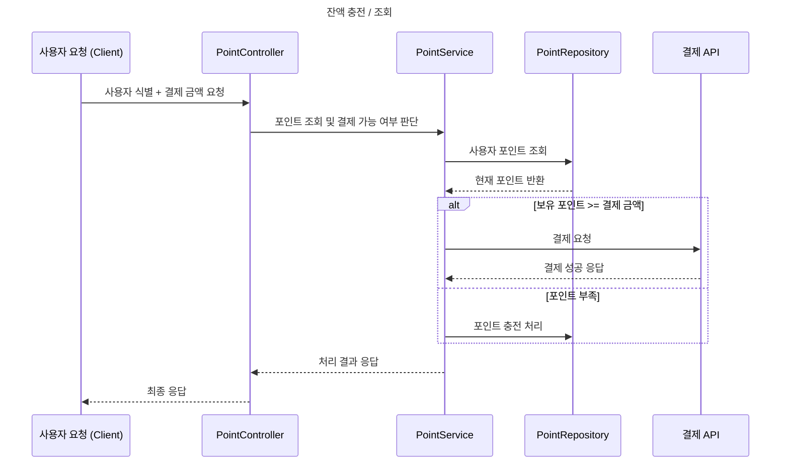

```mermaid

sequenceDiagram
    title 잔액 충전 / 조회

    participant ClientRequest as 사용자 요청 (Client)
    participant PointController
    participant PointService
    participant PointRepository
    participant PaymentAPI as 결제 API

    ClientRequest ->> PointController : 사용자 식별 + 결제 금액 요청
    PointController ->> PointService : 포인트 조회 및 결제 가능 여부 판단
    PointService ->> PointRepository : 사용자 포인트 조회
    PointRepository -->> PointService : 현재 포인트 반환

    alt 보유 포인트 >= 결제 금액
        PointService ->> PaymentAPI : 결제 요청
        PaymentAPI -->> PointService : 결제 성공 응답
    else 포인트 부족
        PointService ->> PointRepository : 포인트 충전 처리
    end

    PointService -->> PointController : 처리 결과 응답
    PointController -->> ClientRequest : 최종 응답

```