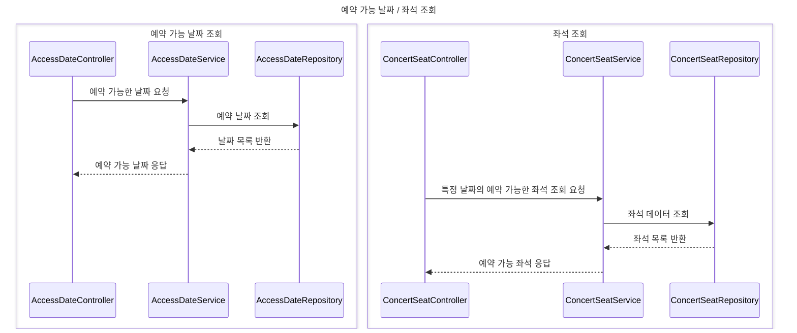

```mermaid
sequenceDiagram
    title 예약 가능 날짜 / 좌석 조회

    box 예약 가능 날짜 조회
        participant AccessDateController
        participant AccessDateService
        participant AccessDateRepository
    end

    box 좌석 조회
        participant ConcertSeatController
        participant ConcertSeatService
        participant ConcertSeatRepository
    end

    AccessDateController ->> AccessDateService : 예약 가능한 날짜 요청
    AccessDateService ->> AccessDateRepository : 예약 날짜 조회
    AccessDateRepository -->> AccessDateService : 날짜 목록 반환
    AccessDateService -->> AccessDateController : 예약 가능 날짜 응답

    ConcertSeatController ->> ConcertSeatService : 특정 날짜의 예약 가능한 좌석 조회 요청
    ConcertSeatService ->> ConcertSeatRepository : 좌석 데이터 조회
    ConcertSeatRepository -->> ConcertSeatService : 좌석 목록 반환
    ConcertSeatService -->> ConcertSeatController : 예약 가능 좌석 응답

```