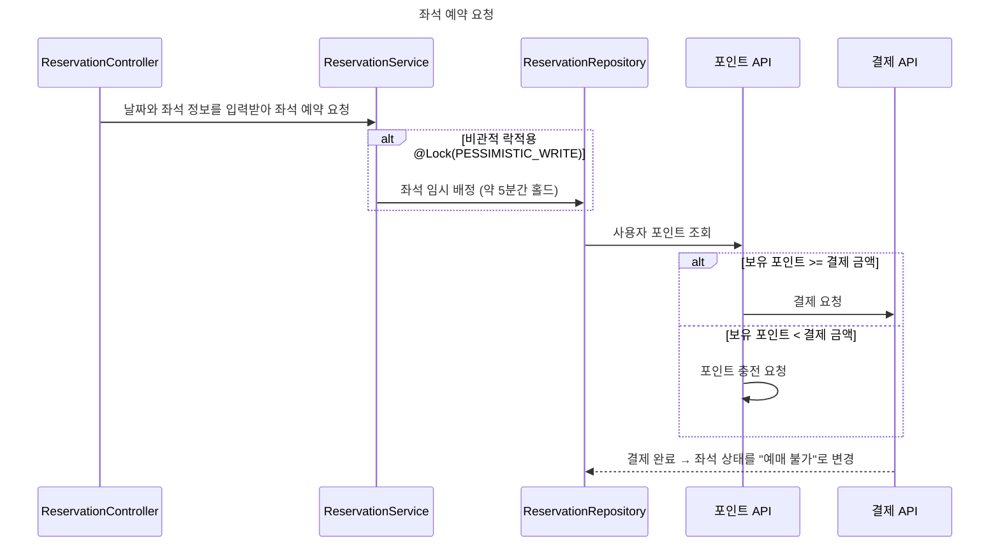

```mermaid
sequenceDiagram
    title 좌석 예약 요청
    participant ReservationController
    participant ReservationService
    participant ReservationRepository
    participant PointAPI as 포인트 API
    participant PaymentAPI as 결제 API
    ReservationController ->> ReservationService : 날짜와 좌석 정보를 입력받아 좌석 예약 요청
    
    alt 비관적 락적용 @Lock(PESSIMISTIC_WRITE)
        ReservationService ->> ReservationRepository : 좌석 임시 배정 (약 5분간 홀드)
    end
    ReservationRepository ->> PointAPI : 사용자 포인트 조회
    alt 보유 포인트 >= 결제 금액
        PointAPI ->> PaymentAPI : 결제 요청
    else 보유 포인트 < 결제 금액
        PointAPI ->> PointAPI : 포인트 충전 요청
    end
    PaymentAPI -->> ReservationRepository : 결제 완료 → 좌석 상태를 "예매 불가"로 변경
```