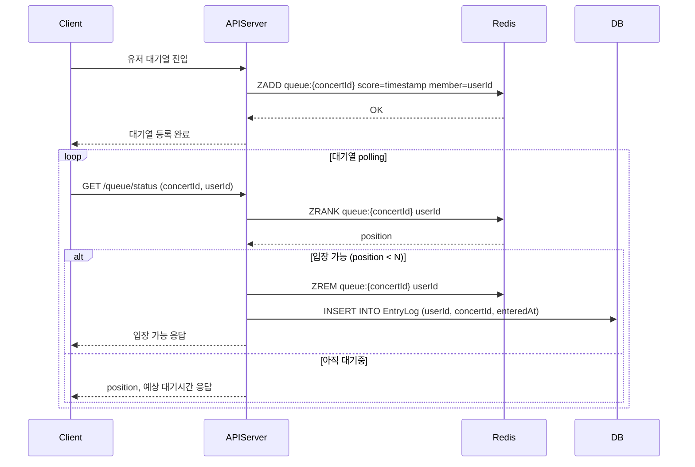

```mermaid
sequenceDiagram
    participant Client
    participant APIServer
    participant Redis
    participant DB
    Client->>APIServer: 유저 대기열 진입
    APIServer->>Redis: ZADD queue:{concertId} score=timestamp member=userId
    Redis-->>APIServer: OK
    APIServer-->>Client: 대기열 등록 완료
    loop 대기열 polling
        Client->>APIServer: GET /queue/status (concertId, userId)
        APIServer->>Redis: ZRANK queue:{concertId} userId
        Redis-->>APIServer: position
        alt 입장 가능 (position < N)
            APIServer->>Redis: ZREM queue:{concertId} userId
            APIServer->>DB: INSERT INTO EntryLog (userId, concertId, enteredAt)
            APIServer-->>Client: 입장 가능 응답
        else 아직 대기중
            APIServer-->>Client: position, 예상 대기시간 응답
        end
    end
```