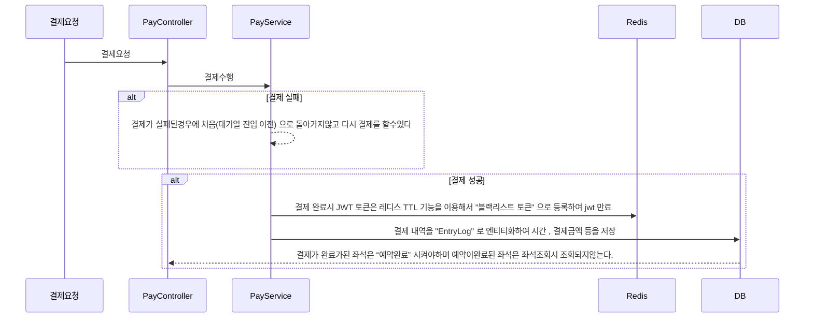

```mermaid
sequenceDiagram
    participant 결제요청
    participant PayController
    participant PayService
    participant Redis
    participant DB
    결제요청 ->> PayController : 결제요청
    PayController ->> PayService : 결제수행
    alt 결제 실패
    PayService -->> PayService : 결제가 실패된경우에 처음(대기열 진입 이전) 으로 돌아가지않고 다시 결제를 할수있다
    end
    
    alt 결제 성공
    PayService ->> Redis : 결제 완료시 JWT 토큰은 레디스 TTL 기능을 이용해서 "블랙리스트 토큰" 으로 등록하여 jwt 만료
    PayService ->> DB : 결제 내역을 "EntryLog" 로 엔티티화하여 시간 , 결제금액 등을 저장
    DB -->> PayController : 결제가 완료가된 좌석은 “예약완료” 시켜야하며 예약이완료된 좌석은 좌석조회시 조회되지않는다.
    end
    
```