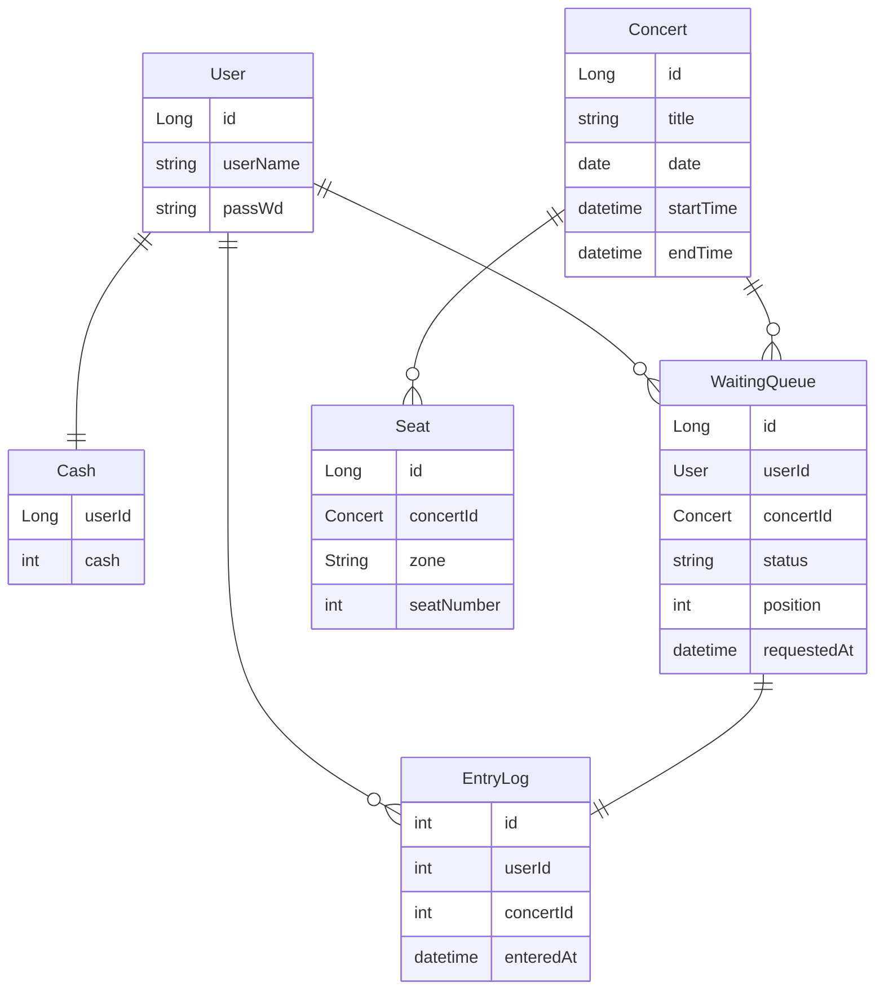

```mermaid
erDiagram

    User ||--|| Cash : ""
    User ||--o{ EntryLog : ""
    User ||--o{ WaitingQueue : ""
    Concert ||--o{ Seat : ""
    Concert ||--o{ WaitingQueue : ""
    WaitingQueue ||--|| EntryLog : ""

    User {
        Long id
        string userName
        string passWd
    }

    Cash {
        Long userId
        int cash
    }

    Concert {
        Long id
        string title
        date date
        datetime startTime
        datetime endTime
    }

    Seat {
        Long id
        Concert concertId
        String zone
        int seatNumber
    }

    WaitingQueue {
        Long id
        User userId
        Concert concertId
        string status
        int position
        datetime requestedAt
    }

    EntryLog {
        int id
        int userId
        int concertId
        datetime enteredAt
    }
```