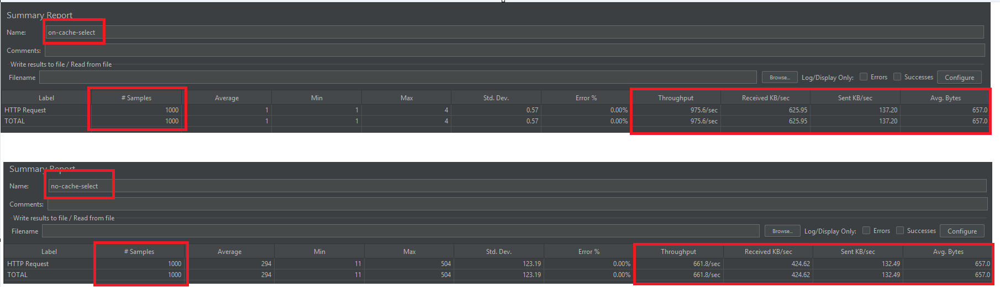

## 캐시 사용(on-cache-select) vs 미사용(no-cache-select) 성능 비교

| 구분             | #Samples | 평균 응답시간(ms) | 최소(ms) | 최대(ms) | 표준편차 | 오류율 | 처리량(Throughput) | 수신 KB/sec | 송신 KB/sec | 평균 바이트 |
|------------------|----------|-------------------|----------|----------|----------|--------|--------------------|-------------|-------------|-------------|
| **on-cache-select** | 1000     | **1**             | 1        | 4        | 0.57     | 0.00%  | **975.6/sec**      | 625.95      | 137.20      | 657.0       |
| **no-cache-select** | 1000     | **294**           | 11       | 504      | 123.19   | 0.00%  | **661.8/sec**      | 424.62      | 132.49      | 657.0       |

### 📊 분석
- **평균 응답시간**
    - 캐시 사용: **1ms**
    - 캐시 미사용: **294ms**  
      → 캐시 사용 시 약 **294배 빠른** 응답 속도를 보임.

- **처리량(Throughput)**
    - 캐시 사용: **975.6/sec**
    - 캐시 미사용: **661.8/sec**  
      → 캐시 사용 시 초당 처리 건수가 약 **47% 향상**.

- **네트워크 사용량**
    - 수신/송신 KB/sec 모두 캐시 사용이 더 높음 → 동일 시간에 더 많은 요청을 처리했음을 의미.

✅ 결론: 캐시 적용 시 요청 처리 속도와 처리량 모두 크게 개선됨.